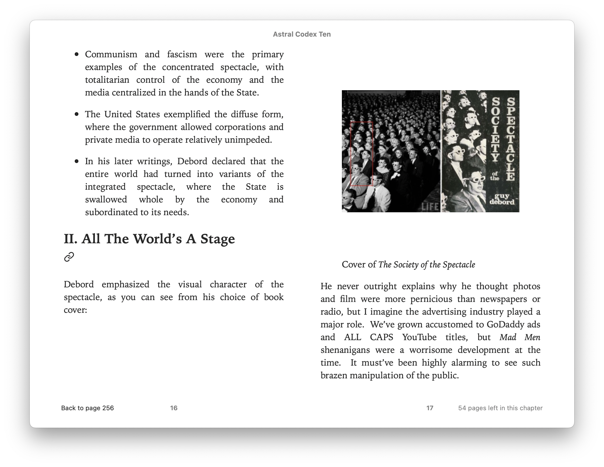

# Astral Codex Ten 2 Epub

Written in one go one sleepless night for me to enjoy astralcodexten.substack.com on my epub reader.

Converts the articles into epub.

More work needed to make the epub pass `epubcheck`.

# How to run

1. [Install poetry][1]
2. `python -m venv ./venv`
3. `source ./venv/bin/activate`
4. `poetry install`
5. `cd astralcodexten2epub && ./main.py`

[1]: https://python-poetry.org/docs/

# Example

